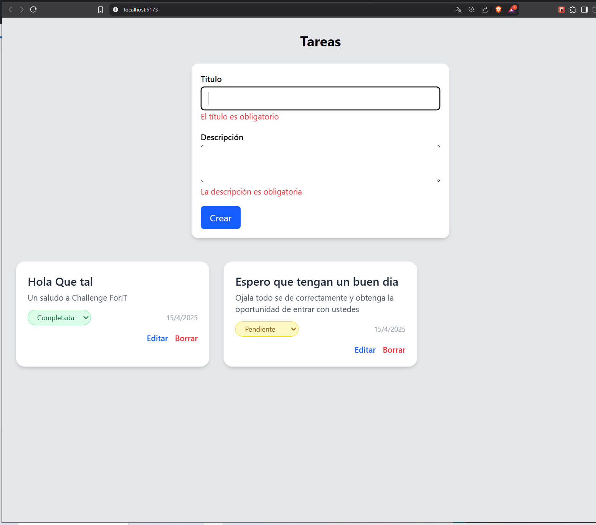

# 🧠 Challenge ForIT 2025 - Task App

Este proyecto fue desarrollado como parte del **Challenge de ingreso a la Academia ForIT 2025**. El objetivo fue crear una aplicación de lista de tareas utilizando tecnologías fundamentales como **Node.js**, **React**, **JavaScript**, y **Git**, demostrando así conocimientos en desarrollo fullstack.

---

## 🎯 Objetivo

Desarrollar una aplicación web que permita **crear**, **leer**, **actualizar** y **eliminar tareas**, utilizando un backend con Express y un frontend con React. El almacenamiento de datos se realiza en memoria.

---

## 🚀 Tecnologías Utilizadas

### 🔧 Backend

- Node.js  
- Express  
- TypeScript  
- Cors
- Dotenv
- Sequelize
- Morgan

### 🖥️ Frontend

- React + Vite  
- TypeScript  
- TailwindCSS  
- React Router DOM  
- Fetch API  
- React Hook Form + Yup (para validación)

---

📖 ENDPOINTS DEL BACKEND

FUNCIONALIDADES PRINCIPALES
---------------------------------------------------------
| MÉTODO   | ENDPOINT                | DESCRIPCIÓN                  |
|----------|-------------------------|------------------------------|
| GET      | /api/tasks              | Obtener todas las tareas     |
| POST     | /api/tasks              | Crear una nueva tarea        |
| PUT      | /api/tasks/:id          | Actualizar una tarea         |
| DELETE   | /api/tasks/:id          | Eliminar una tarea           |
---------------------------------------------------------

EXTRAS IMPLEMENTADOS
- Almacenamiento con SQLite
- Manejo básico de errores
- Validación de formularios con Yup
- Uso de variables de entorno para configuración

---

## 🧪 Cómo Ejecutar el Proyecto

### 1. Clonar el repositorio
git clone https://github.com/AlejandroPerren/Challenge-ForIT-2025.git cd Challenge-ForIT-2025


### 2. Configurar archivos `.env`

Agrega un archivo `.env` en la raíz tanto del **backend** como del **frontend** con la siguiente información:

**Backend (.env):**
PORT=8080 # o el puerto que prefieras

**Frontend (.env):**
VITE_API_URL=http://localhost:8080/api

⚠️ IMPORTANTE: Para que todo funcione correctamente, debes abrir dos consolas o terminales diferentes, una para correr el backend y otra para el frontend.
Si detenés y volvés a iniciar solo el frontend sin reiniciar el backend, puede que la app no funcione correctamente.

----------------------------------------
TERMINAL 1 – INICIAR BACKEND
```bash
   cd backend
   npm install
   npm run dev
```
----------------------------------------
TERMINAL 2 – INICIAR FRONTEND
```bash
   cd frontend
   npm install
   npm run dev
```

---

## 👨‍💻 Autor

**Alejandro Perren**  
📧 aletomasperren@gmail.com  
🔗 GitHub: https://github.com/AlejandroPerren
